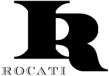

# 

**Rocati Token** is an utility token designed to support the activities of Itarco, a real estate company owned by Rocati Limited.

It's an ERC20 standard Token, including:

 * ability for holders to burn (destroy) their tokens;
 * an owner address that allows for token minting (creation);
 * a notary role that allows to receive the transfer of newly minted tokens.
